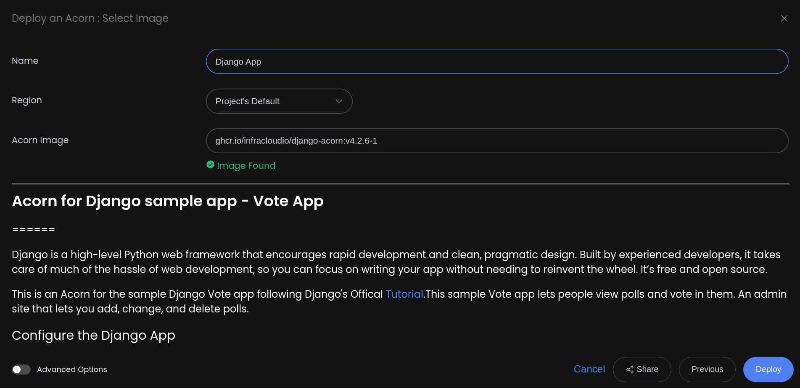
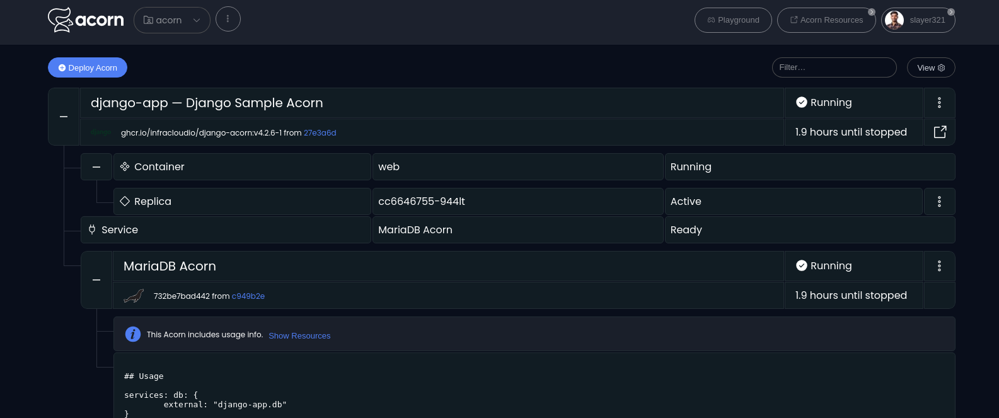
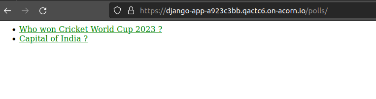

# Deploying a Sandbox Django Application

[Django](https://www.djangoproject.com/) is one of the well known free and open source web frameworks based on Python. It is a high-level framework known for its rapid development and design. It enables development of secure and maintainable websites with clean and pragmatic design.

[Acorn](http://www.acorn.io) offers a cloud computing platform, providing a free sandbox accessible using your GitHub account. Acorn simplifies running cloud-native apps on the public cloud, utilizing familiar development workflows without the need for provisioning or configuring underlying cloud resources. With Django's hassle-free web development and Acorn's streamlined cloud deployment, developers can focus on building robust applications without reinventing the wheel.

Acorn platform is based on the free and open source [Acorn runtime](https://www.acorn.io/opensource). It is a lightweight application packaging and deployment framework. It makes developers productive and efficient by encapsulating both the application and its associated dependencies, including cloud technologies such as Kubernetes and Docker, within a singular [Acornfile](https://docs.acorn.io/reference/acornfile). In this tutorial, we will deploy a sample Django application from the [official documentation](https://docs.djangoproject.com/en/4.2/intro/tutorial01/) on the Acorn cloud platform.This Django app is sample vote application.

If you want to skip to the end, just click the link below to launch the app immediately in a free sandbox environment. All you need to join the Acorn platform is your GitHub ID. Click below to create your free account.

[](https://acorn.io/run/ghcr.io/infracloudio/django-acorn:v%23.%23.%23-%23?ref=samkulkarni20)

_Note: Everything shown in this tutorial can be found in [this repository](https://github.com/infracloudio/django-acorn.git)_.

## Pre-requisites

- Acorn CLI: The CLI allows you to interact with the Acorn Runtime as well as Acorn to deploy and manage your applications. Refer to the [Installation documentation](https://docs.acorn.io/installation/installing) to install Acorn CLI for your environment.
- A GitHub account is required to sign up and use the Acorn Platform.

## Acorn Login

Log in to the [Acorn Platform](http://www.acorn.io) using the GitHub Sign-In option with your GitHub user.


After the installation of Acorn CLI for your OS, you can login to the Acorn platform.

```sh
$ acorn login
```

## Create the Django Application

For this tutorial, we will create a basic vote poll application which is part of get started guide of the offical [documentation](https://docs.djangoproject.com/en/4.2/intro/tutorial01/). Vote poll application provides standard CRUD features, such as viewing polls and vote in them. Futhermore an admin site which comes by default by Django, will allow to add, change, delete polls. So, building this project is easy as following the get started steps, and for deploying this application on Acorn Platform, we have two ways:

1. Using Acorn platform dashboard.
2. Using CLI

The first way is the easiest one where, in just a few clicks you can deploy the Vote Poll application on the platform and start using it. However, if you want to customize the application or want to understand how you can run your own Django applications using Acorn, use the second option.

## Deploying Using Acorn Dashboard

In this option you could use the published Acorn application image to deploy the Vote Poll sample application in just a few clicks. This allows you to deploy applications faster without any additional configurations.

Let us see below how you can deploy the vote app using the Acorn dashboard.

1. Login to the [Acorn Platform](https://acorn.io/auth/login) using the Github Sign-In option with your GitHub user.
2. Click the "Deploy Acorn” button.
3. Choose the source for deploying your Acorns
   3.1. Select “From Acorn Image” to deploy the sample Application.
   

4. Provide a name "Django Sample Acorn”, use the default Region and provide the URL for the Acorn image and click `Deploy`.

   ```sh
   ghcr.io/infracloudio/django-acorn:v4.#.#-#
   ```

   

> _Note: The App will be deployed in the Acorn Sandbox Environment. As the App is provisioned on AcornPlatform in the sandbox environment it will only be available for 2 hrs and after that it will be shutdown. Upgrade to a pro account to keep it running longer_.

5. Once the Acorn is running, you can access it by clicking the Endpoint or the redirect link.



6. Accessing Vote Application via Endpoint.



## Deploy Using Acorn CLI

Running the Acorn application using CLI helps you understand the Acornfile plus allows to futher customize the application as per your requirement. Understanding of Acornfile and Acorn will help you run your own Django application.

To run the application using CLI you first need to clone the source code repository on your machine.

```sh
$ git clone https://github.com/infracloudio/django-acorn.git
```

Once cloned here’s how the directory structure will look.

```
.
├── Acornfile
├── assets
├── django.svg
├── LICENSE
├── mysite
│   ├── db-script.sh
|   |.....
│   └── requirements.txt
├── README.md
└── tutorial.md
```

### Understanding the Acornfile

When you're done building the application and ready to run it you will need to define an Acornfile which describes the whole application without all of the boilerplate of Kubernetes YAML files. With Acorn CLI you can build, deploy, and operate Acorn on the Acorn Platform. If you're running an open source Acorn Runtime in any Kubernetes Cluster, it will work just fine.

Below is how you define an Acornfile for Vote Poll application that we created earlier:

```sh
args: {
  djangodbname: "djangodb"
}

services: db: {
  image: "ghcr.io/acorn-io/mariadb:v10.11.5-1"
    serviceArgs: {
      dbName: args.djangodbname
  }
}
containers: web: {
  build: {
    context:    "./mysite"
    dockerfile: "./mysite/Dockerfile"
	}
  ports: publish: "8000:8000/http"
	if args.dev {dirs: "/app": "./mysite"}
	env: {
    MARIADB_USER:          "@{service.db.secrets.admin.username}"
    MARIADB_ROOT_PASSWORD: "@{service.db.secrets.admin.password}"
    MARIADB_HOST:          "@{service.db.address}"
    MARIADB_PORT:          "@{service.db.port.3306}"
    MARIADB_DATABASE:      "@{service.db.data.dbName}"
	}
}
```

Let's go through each requirements and each elements which are defined in the file. There are two main requirements for running Django Application: Application itself, and DB.

The above Acornfile consist following elements:

- **Args**: this allowes allow users to provide input at different points in the Acorn lifecycle.
- **Services**: defines cloud services that will be provisioned for your application, in this case we're using the [MariaDB](https://github.com/acorn-io/mariadb) service that is built into Acorn as an [Acorn Service](https://docs.acorn.io/reference/services).
- **Containers**: It defined the set of containers your Acorn application is consist of, in this case a container named web with following configurations:
  - **build**: details required to build the Django Application, basically the context of build.
  - **ports**: port number the application is listening on and we are also specifying [publish field](https://docs.acorn.io/reference/acornfile#ports) which will give the url to access the application.
  - **env**: here we providing all the env variables which the application will be using and these env variables will override all the default values which require environment value within settings.py file.

### Running the Application

In the starting of this tutorial, we logged in using Acorn CLI, now you can directly deploy applications on your Acorn sandbox evironment. Run the following command from the root of the directory.

```sh
$ acorn run -n django-app -i
```

Below is what the output looks like.


## The Vote Poll Application

As it is a simple Vote Poll application it provides CRUD features. It’ll consist of two parts:

- A public site that lets people view polls and vote in them.
- An admin site that lets you add, change, and delete polls.

On the homepage you will get the admin credentails which can be used to login as admin and you can add question for your vote app.


## Running the application in development mode

If you are developing your application and don't want to start and stop the application everytime you make the changes you can use the extremely helpful dev mode feature of Acorn CLI. Running in dev mode allows you to do continous development of the application, and have your running instance reflect the changes as soon as you save your changes.

To run the dev mode, please use below command.

```sh
$ acorn dev -n django .
```

## Push an artifact to a registry

Using the Dev mode you can easily modify the application as per your requirement and once the application is working as expected and is ready to be built and packaged. You can push it to any OCI registry. In this tutorial we used Github Container Registry. Once published, you can use the Acorn image to deploy it directly from the Acorn platform using the dashboard as described earlier.

To push to OCI registry like GitHub Container Registry, you can follow below steps --

### Log in to the registry

Log in to the registry with the command below and follow the prompts.

```sh
$ acorn login ghcr.io
```

### Build and push the image

Build and push the image with the below command.

```sh
$ acorn build --push -t ghcr.io/infracloudio/django-acorn:v4.2.6-1
```

Once the application is built and pushed you can use those images to run your application on Acorn Platform.

## What's Next?

1. In Acorn Sandbox plan, any provisioned application is available for two hours, you should upgrade to `Pro` account if you want to keep application running for longer durations.
2. After deploying you can edit the Acorn Application or remove it if no longer needed. Click the `Edit` option to edit your Acorn's Image. Toggle the Advanced Options switch for additional edit options.
3. Remove the Acorn by selecting the `Remove`` option from your Acorn dashboard.

## Conclusion

In this tutorial we learned how to use the Acornfile and deploy simple Django application. Also, how easy is it to make changes to Application when you are developing it without the need of restarting your application. Lastly, If you are looking to run the application directly you can run it on Acorn Platform by providing the image name directly.
